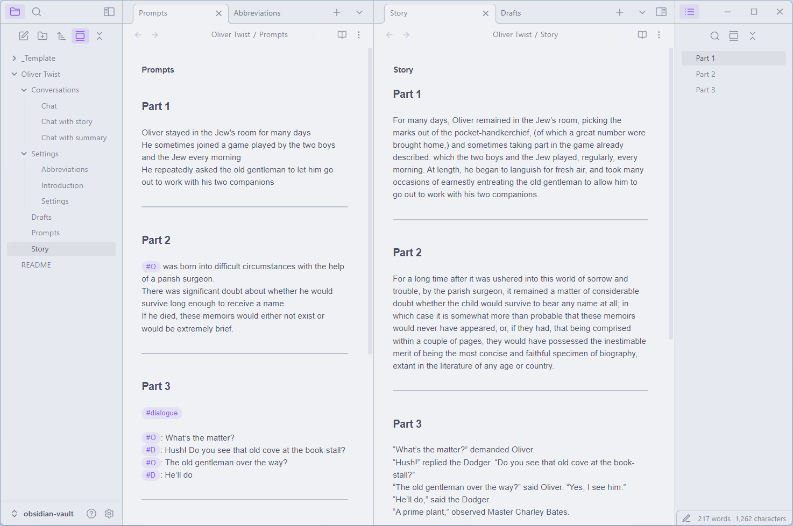

This repo features an **Obsidian** vault.  
It allows to use Obsidian for AI assisted **creative writing** with multiple models via **OpenRouter** API.  
It also includes **Chat** and **Chat with your story** features.

## Installation instructions for Windows:
1. Install [Python 3.12](https://www.python.org/downloads/release/python-3122/)  
2. [Download](https://github.com/aksenov-fx/ai-creative-writing-backend/archive/refs/heads/main.zip) the Python backend app.  
3. Run `initialize.bat`  
The script will install Python dependencies and ask for your OpenRouter API key.  
4. Run `start.bat`  
5. [Download](https://github.com/aksenov-fx/ai-creative-writing-obsidian-vault/archive/refs/heads/main.zip) and open this vault in Obsidian.  

## How to use
Open the Vault folder as a vault in Obsidian and set cursor on a prompt.

Use the following hotkeys:  
**Alt+S** - Set prompt  
**Alt+W** - Write scene / Chat  
**Alt+C** - Custom prompt  
**Alt+A** - Rewrite selection  
**Alt+Z** - Delete last response  
**Alt+~** - Stop writing  
**Alt+T** - Manage workspaces  
**Alt+E** - Save and change workspace  
**Alt+R** - Reset model to default  

**Alt+1-5** - Set model number 
Models are set in `_includes\Settings\Models.yaml`  
Default model can be changed in `_includes\Settings\Settings.yaml`  
To chat with model without updating `Models.yaml`, input the model name from OpenRouter into frontmatter `Model` property instead of model number

Current models:
1. Deepseek R1  
2. Kimi K2  
3. Deepseek V3.1  
4. Claude 4  
5. Gemini 2.5 Flash  

## Obsidian Story writing commands
**Write Scene**  
Story mode: append writing instructions to a user prompt and write next part of the story.  

**Custom Prompt**  
Make prompt without writing instructions  

**Rewrite selection**  
Rewrite selected text according to prompt

**Rewrite part**  
Rewrite a selected part of the story according to prompt  

**Rewrite this and the following parts**  
Rewrite selected and the following parts  

**Regenerate**  
Regenerate a selected part of the story  

**Add Part**  
Add a new story part after a selected part  

**Continue response**  
Continues the selected part.
*Note: to the model the text appears as the beginning of its own response - not as user request.*
*Different inference providers process such requests differently and some may work incorrectly.*
*It is possible to exclude these providers from routing requests in Openrouter settings.*

**

**Remove Last Response**  
Remove last story part  

**Update summary**  
Create or update story summary  
Only updates summaries for story parts that were added or changed  

*Please check python app terminal output to understand how prompts are composed for each command*

## Obsidian Chat commands
**Chat**  
Chat with the model

**Remove Last Response**  
Remove last chat response  

## Common commands

**Translate selection**  
Show translation for selected text in a language, defined in settings  

**Explain word**  
Show definition for a selected word  

## Optional steps
- Edit `_includes\settings` files to change default settings, models, prompts and abbreviations
- Edit files in story `Settings` folder in Obsidian to change settings individually per story

## Settings

**Use summary**  
Replace story parts with summaries in API request to reduce token usage.  
The last story part will remain original to preserve writing style.

**Summary model**  
Model used to summarize story.  

**Trim history**  
Exclude first paragraphs until story lengh matches max_tokens

**Include previous part when rewriting**  
If False, only the current part text will be included in API request when rewriting.  
Makes sense when the changes do not require story context.  
For example, when changing story tense, style etc.

**Print reasoning**  
Print reasoning in terminal when using models that output reasoning tokens, like DeepSeek R1  

## How it works
To get a response, **Obsidian** sends a TCP request to python app, which listens on port **TCP 9993**.  
The app gets a response and writes it to MD file, while **Obsidian** displays the changes in real time.  

## Credits:
Dmitry Savosh for [Remember cursor position](https://github.com/dy-sh/obsidian-remember-cursor-position) plugin  